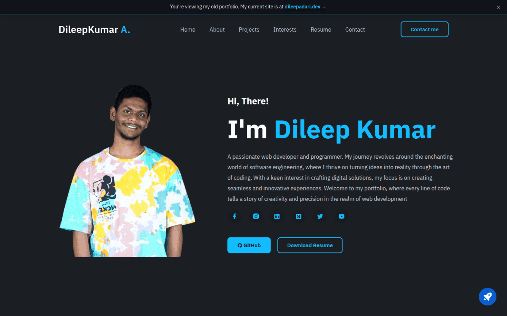
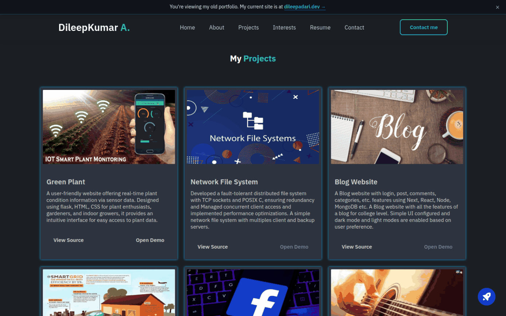
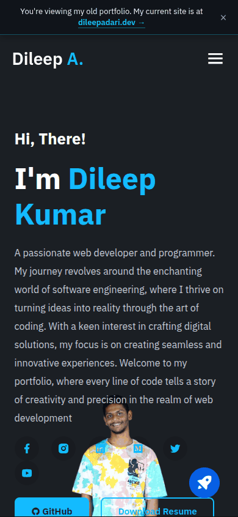

<div align="center">

<picture>
  <source media="(prefers-color-scheme: dark)" srcset="./docs/assets/adk_dev_logo_light.png">
  
</picture>

# Dileepadari.github.io

**My first portfolio, kept online as an archive. Hand-written HTML and CSS with no framework, plus a second config-driven version built on Jinja.**


<br>


<br><br>

**[Developer documentation](./DEVDOC.md)** · [Live archive](https://dileepadari.github.io)

</div>

---

> **This is my old portfolio.** My current site lives at **<https://dileepadari.dev>**.
> This one stays online as an archive of where I started.

Live archive: <https://dileepadari.github.io>

## Screenshots

The root site as it stands. There is no light mode to switch to, so unlike the other
projects in this account there is no `README-light.md`: this site has one theme and
always did.

<table>
  <tr>
    <td width="50%" valign="top">
      
      <p align="center"><b>Home</b><br><sub>The archive banner sits above the original page, untouched.</sub></p>
    </td>
    <td width="50%" valign="top">
      
      <p align="center"><b>Projects</b><br><sub>The grid, frozen at roughly its 2024 contents.</sub></p>
    </td>
  </tr>
</table>

<details>
<summary><b>On a phone</b></summary>
<br>
<p align="center">
  
</p>

Below 680px the layout swaps the side photo for a fixed background image, which
collides with the social icons and the two buttons. It is the original design's
behaviour and it is left alone, because this repository is an archive rather than
a thing under maintenance.
</details>

It is the first portfolio I built - hand-written HTML and CSS, no framework, no
build step for the main page - plus a second, config-driven version I started
later. Both are still here and both still work. Nothing here is actively
maintained; content is frozen at roughly its 2024 state.

## The two sites

This repo hosts two independent portfolios that were never merged:

| | Root site | Jinja site |
| --- | --- | --- |
| URL | `/` | `/jinja/` |
| Entry point | `index.html` (hand-written, single page) | `jinja/src/jinja/index.jinja` + 7 partials |
| Content lives in | the HTML itself | 8 TOML files in `jinja/config/` |
| Styles / scripts | `css/style.css`, `js/script.js` | `jinja/src/css/style.css`, `jinja/src/js/script.js` |
| Build | none | `python main.py` (runs in CI on every push to `main`) |

The root site is what you get at the bare domain. The Jinja one is a
config-driven rewrite, adapted from someone else's template (see
[Credits](#credits)), that I never finished switching over to.

See [DEVDOC.md](DEVDOC.md) for how it all fits together, including the slightly
surprising deployment pipeline.

## Running it locally

Serve the repo root - the pages use root-relative paths, so opening the files
directly with `file://` will not work properly:

```bash
python3 -m http.server 8000
# then visit http://localhost:8000
```

To rebuild the Jinja site:

```bash
cd jinja
pip install -r requirements.txt
python main.py          # writes jinja/index.html (gitignored)
# then visit http://localhost:8000/jinja/
```

## What's at which URL

| Path | What it is |
| --- | --- |
| `/` | The main portfolio - about, projects, skills, contact form |
| `/cv/` | Resume viewer for `docs/portfolio.pdf`, with a download fallback |
| `/jinja/` | The config-driven second portfolio |
| `/tasks/` | Redirect to my Notion task board |
| `/resources.html` | Redirect to my Notion resources page |
| `/love/` | A small standalone toy page |
| `/todo/` | A Fluent-UI-styled todo app (static front end; the Flask backend in `todo/app.py` is not deployed) |
| `/temp_test/` | Parked one-off files - see [temp_test/README.md](temp_test/README.md) |

## Layout

```
index.html            root site (single page)
css/  js/  images/    its assets
cv/                   resume viewer -> docs/portfolio.pdf
docs/                 resume sources and PDF exports (LaTeX + Typst)
certificates/         scanned certificates
jinja/                the second, config-driven site
  config/*.toml       its content
  config/assets/      its images and icons
  src/                its templates, CSS and JS
  main.py             the generator
love/ todo/ tasks/    small standalone pages
temp_test/            parked one-off files
.github/workflows/    GitHub Pages deployment
```

## Credits

- The Jinja site is adapted from [ivansaul](https://github.com/ivansaul)'s
  portfolio template, MIT licensed - see [`jinja/LICENSE`](jinja/LICENSE).
- Images are optimised automatically by [ImgBot](https://imgbot.net/).
- Icons from [Boxicons](https://boxicons.com/),
  [Remix Icon](https://remixicon.com/) and [Ionicons](https://ionic.io/ionicons);
  scroll animations by [AOS](https://michalsnik.github.io/aos/).

## License

MIT, see [LICENSE](./LICENSE). The `jinja/` subtree keeps its own
[`jinja/LICENSE`](jinja/LICENSE), also MIT, because the template it came from is
somebody else's work and their copyright notice stays with it.
